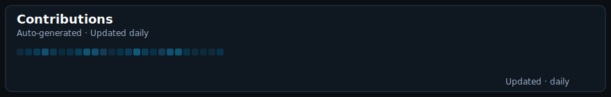

<h1 align="center">Hi 👋, I'm Vishal Singh Rajpurohit</h1>
<h3 align="center">A passionate Machine Learning developer from India</h3>

  

  

  

- 🔭 I’m currently working on **My Skill**
- 🌱 I’m currently learning **AI**
- 👯 I’m looking to collaborate on **Machine Learning Projects**
- 👨‍💻 All of my projects are available at **https://github.com/VishalSingh-Rajpurohit?tab=repositories**
- 💬 Ask me about **Python, Machine Learning**
- 📫 How to reach me **vsrajpurohit0666@gmail.com**

 

<!-- ================= MACHINE LEARNING MAIN SECTION ================= -->

<h2 align="left">⚙️ Machine Learning</h2>

<h3>🔥 Tools & Libraries I Use</h3>

  <!-- Pandas -->
  

  <!-- NumPy -->
  

  <!-- scikit-learn -->
  

  <!-- TensorFlow -->
  

  <!-- Keras -->
 

  <!-- PyTorch -->
  

 

<!-- ================= SOCIAL SECTION ================= -->

<h3 align="left">Connect with me:</h3>

 

## 🟩 HackerRank — Live Stats  
(Automatically updates every 6 hours)

  

📊 **Your Live HackerRank Progress:**  
👉 Click to view full stats:  📄 **[HACKERRANK_STATS.md](./HACKERRANK_STATS.md)**

## 🟩 LeetCode — Live Stats (Auto Updated)

  

<!-- ================= STATS SECTION ================= -->
<h3> Contributions </h3>

  

